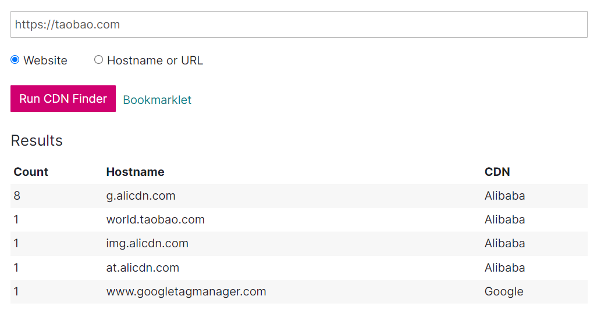

# 信息收集

信息收集——渗透测试的灵魂
为什么要信息收集？
有句话说“知己知彼，百战不殆”。最了解你的人往往都是你的对手。
当你所掌握到的信息比别人多且更详细的时候那么你就占据了先机，这一条不仅仅用于商业、战争、渗透测试中也适用。

信息收集的方向、究竟收集什么？
以 https://www.carrycyebo.com 这个网站为例，你知道这个网站是谁的(注册人/机构)吗？
当查到了网站所属的机构是某个公司后，那你能找到这个公司旗下拥有的其它网站吗？
你访问网站后发现他是某个机构的官网，那你能发现这个网站使用了什么编程语言，php还是jsp；使用了什么WEB容器，apache还是iis ; 网站的后台地址是什么；网站使用的服务器是windows还是linux，服务器的ip是什么, 这个ip上都开放了哪些端口?；这个网站是不是某一款流行的cms产品？。

## 课程地址


**B站小迪** 

**课程地址：**【【小迪安全】web安全｜渗透测试｜网络安全（6个月线上培训全套）】 https://www.bilibili.com/video/BV1JZ4y1c7ro/?share_source=copy_web&vd_source=fa715c38d98cfad5eca2b2a583b8101e

**信息收集**看P8、P9、P10三节课程，看不懂的同学，比如不知道什么是端口、ip等这些必要知识，去补习P1~P7的计算机基础知识


**B站农夫众信**

**课程地址：**【农夫安全201-A1-bupsuite的使用5】 https://www.bilibili.com/video/BV1mt4y1J7Ci/?share_source=copy_web&vd_source=fa715c38d98cfad5eca2b2a583b8101e

**课程课件：**该课程课件为在线文档，访问：http://book.fsec.io 找到对应目录即可

**工具篇**中介绍了大量信息收集的工具，信息收集可以看这个


## 1.域名信息查询

### 什么是域名？

**域名**（**Domain Name**），又称**网域**，是由一串用点分隔的名字组成的Internet上某一台计算机或计算机组的名称，用于在数据传输时对计算机的定位标识（有时也指地理位置）。 

由于IP地址具有不方便记忆并且不能显示地址组织的名称和性质等缺点，人们设计出了域名，并通过网域名称系统（DNS，Domain Name System）来将域名和IP地址相互映射，使人更方便地访问互联网，而不用去记住能够被机器直接读取的IP地址数串。

计算机是不认识域名的，域名只是为了方便人们记忆而进行创建的

域名解析示例：secdriver.com  -> DNS 服务器  114.114.114.114  -> 47.94.98.63

域名ip查询：

```shell
ping secdriver.com   # ping DNS解析
nslookup secdriver.com  # nslookup DNS解析
```


### 域名级别

域名可分为不同级别，包括顶级域名、二级域名等

#### 顶级域名

**国家顶级域名**（national top-level domainnames，简称nTLDs），200多个国家都按照ISO3166国家代码分配了顶级域名，例如中国是 .cn，美国是 .us，日本是 .jp 等

**国际顶级域名**（international top-level domain names，简称iTDs），例如表示工商企业的 .com，表示网络提供商的 .net，表示顶级标杆、个人的 .top，表示非盈利组织的.org等


#### 二级域名

二级域名是指顶级域名之下的域名，在国际顶级域名下，它是指域名注册人的网上名称，例如 ".ibm"，".yahoo"，".microsoft"等；在国家顶级域名下，它是表示注册企业类别的符号

#### 三级域名

三级域名用字母（a～z）、数字（0～9）和连接符（－）组成， 各级域名之间用实点（.）连接，三级域名的长度不能超过20个字符，域名长度有限，最多可注册63个字符，域名总长度不能超过253个字符


### 什么是子域名？

**子域名**（**Subdomain**）是在域名系统等级中，属于更高一层域的域。比如，mail.example.com和calendar.example.com是example.com的两个子域，而example.com则是顶级域 .com 的子域。


### IP反查域名

通过IP可以反查出绑定在该网站的域名，来发现更多资产

ip138:  https://site.ip138.com/

webscan: https://www.webscan.cc/

VirusTotal: https://www.virustotal.com

微步在线：https://x.threatbook.cn/


### Whois查询

whois指的是域名注册时留下的信息，比如留下管理员的名字、电话号码、邮箱。

知道目标的域名之后，我们要做的第一件事就是获取域名的whois信息，因为域名注册人可能是网站管理员，可以尝试社工、套路，查询是不是注册了其他域名扩大攻击范围。

#### 查询网站

爱站工具网: https://whois.aizhan.com

站长之家: http://whois.chinaz.com

VirusTotal: https://www.virustotal.com

通过这些网站可以查询域名的相关信息，如域名服务商、域名拥有者，以及他们的邮箱、电话、地址等。

#### kali工具

whois 域名

```shell
whois www.secdriver.com   
```

### ICP备案信息查询

网站备案是根据国家法律法规规定，需要网站的所有者向国家有关部门申请的备案，这是国家信息产业部对网站的一种管理，为了防止在网上从事非法的网站经营活动的发生。主要针对国内网站，如果网站搭建在其他国家，则不需要进行备案。

常用的网站有以下几个：

工业和信息化部政务服务平台：https://beian.miit.gov.cn/

全国互联网安全管理平台：http://www.beian.gov.cn/portal/recordQuery

天眼查：http://www.tianyancha.com


### 子域名收集

假设我们的目标网络规模比较大，直接从主域入手显然是很不理智的，因为对于这种规模的目标，一般其主域都是重点防护区域，所以不如先进入目标的某个子域，然后再想办法迂回接近真正的目标。


#### 网站查询子域名

VirusTotal  https://www.virustotal.com/gui/home/search

fofa  https://fofa.info/

#### 工具扫描

Layer子域名挖掘机


## 2.端口信息

计算机“端口”是英文port的义译，可以认为是计算机与外界通讯交流的出口，计算机有0~65535，共计65536个端口。

端口作为服务器和客户端交互的接口，起着非常重要的作用。一些常见的端口标识出服务器开启了什么服务，比如3389端口开启，可以认为服务器系统为windows并且开启了远程服务的功能。所以，端口扫描在渗透测试中是非常重要的。

### 插件探测

#### **Fofa Pro view**


#### shodan


### 工具扫描

#### nmap

nmap 是一款开源免费的针对大型网络的端口扫描工具，nmap可以检测目标主机是否在线、主机端口开放情况、检测主机运行的服务类型及版本信息、检测操作系统与设备类型等信息

nmap常用参数

| 参数            | 解释                                                         |
| --------------- | ------------------------------------------------------------ |
| -sP             | Ping扫描                                                     |
| -sS             | 快速扫描，SYN 半开放扫描                                     |
| -sT             | TCP全连接扫描（默认）                                        |
| -sU             | UDP端口扫描，不准确                                          |
| -sA             | 穿过防火墙的规则集，速度慢                                   |
| -P0             | 空闲扫描，无Ping扫描                                         |
| -PN             | 防火墙禁ping，不使用ping扫描                                 |
| -PR             | ARP Ping 扫描，速度很快                                      |
| -PS             | TCP SYN Ping扫描                                             |
| -PA             | TCP ACK Ping扫描                                             |
| -sV             | 端口服务及版本                                               |
| -sC             | –script=default 默认的脚本扫描，主要是搜集各种应用服务的信息 |
| -O              | 探测目标系统版本                                             |
| -A              | 包含了-sV，-O，全面系统检测，启动脚本检测，扫描漏洞等（有误报） |
| -p              | 指定端口号 如: 80,81,8000-9000                               |
| -T              | 扫描速度T0~T5 ,默认T3， 速度越快精度越低                     |
| --open          | 只显示开放的端口                                             |
| -v / -vv        | 显示详细信息，-vv 比 -v 更详细                               |
| -iL             | 从文件导入要扫描的 ip 列表                                   |
| -oN / -oX / -oG | 将报告写入文件，格式分别为正常（自定义.txt）,XML,grepable    |
| -exclude        | 排除某些不需要扫描的 ip                                      |

##### 基本使用

```shell
nmap 192.168.23.1/24 # Nmap 默认发送⼀个arp的ping数据包，来探测⽬标主机在1-10000范围内所开放的端⼝
```

##### 主机发现

主机发现的原理与Ping命令类似，发送探测包到目标主机，如果收到回复，那么说明目标主机是开启的

```shell
nmap -sP 192.168.1.0/24  # 进行ping扫描，打印出对扫描做出响应的主机,不做进一步测试端口扫描或者操作系统探测
```

##### 操作系统识别

```shell
nmap -O 192.168.23.1     # 操作系统版本探测
nmap -O --osscan-limit 192.168.23.1  # 探测操作系统版本详细信息
nmap -O --osscan-guess 192.168.23.1  # 猜测操作系统版本

nmap -A 192.168.23.1     # 操作系统探测和服务版本探测等
```

##### 端口扫描

```shell
nmap -sT 192.168.23.1 -p 21,22,23,53,80,135,443,445 # (默认) TCP全连接扫描,常见端口
nmap -sS 192.168.23.1 -p 1-3000 --open -vv  # (常用) 快速扫描 1-3000 范围端口,只显示开放端口信息
nmap -PN 192.168.23.1 -p 1-3000  # 不使用ping命令扫描
nmap -PR 192.168.23.1 -p 1-3000  # arp扫描，内网中局域网防火墙不拦截，速度很快
nmap -P0 192.168.23.1 -p 1-3000  # 空闲扫描，不会留下记录

nmap -sV 192.168.81.148 -p 3389,5985,6588,999,21,80 -A  # 探测端口信息
```

##### 格式化输出

```shell
# 使用 nmap 结果美化 model, 美化 nmap 输出的 xml 文档，使用-oX xxx.xml 或者 -oA xxx 可将结果导出为 xml 格式
# 端口信息探测 + 系统探测 + 基础扫描
nmap -sV -A 192.168.23.1 -p 80,88,135,139,443,445,903,1080,1688,3306,5357 -oA mysite
nmap -sV -A 192.168.23.1 -p 80,88,135,139,443,445,903,1080,1688,3306,5357 -oX mysite.xml
# 格式化 xml 文档
xsltproc -o mysite.html mode.xsl mysite.xml

# 使用浏览器打开 html 文档
firefox mysite.html
```

##### 常见端口

```
80,89,8000,9090,1433,1521,3306,5432,445,135,443,873,5984,6379,7001,7002,9200,9300,11211,27017,27018,50000,50070,50030,21,22,23,2601,3389
```


#### masscan

masscan 是 Kali 下集成的高效扫描器 , 速度非常快

masscan 常用参数

| 参数                       | 解释                                                         |
| -------------------------- | ------------------------------------------------------------ |
| --ping                     | 发送icmp数据包，进行主机存活探测                             |
| -adapter-ip                | 指定发包的ip地址（伪造ip）                                   |
| --adapter-port             | 指定发包源端口                                               |
| --adapter-mac              | 指定发包的源MAC地址                                          |
| --router-mac               | 指定网关MAC地址                                              |
| --exclude                  | IP地址范围黑名单，不扫描的IP                                 |
| --excludefile              | 指定IP地址范围黑名单文件                                     |
| --includefile / -iL        | 读取一个范围列表进行扫描                                     |
| --wait                     | 指定在退出程序之前等待接收数据包，默认值为10秒               |
| -p                         | 指定要扫描的端口类型及范围  -p U：1024-1100                  |
| --rate                     | 指定线程数，推荐1000~3000                                    |
| --banners                  | 抓取端口服务信息，仅支持部分协议                             |
| --open-only                | 只显示开放的端口                                             |
| --http-user-agent          | 使用指定的user-agent发送http请求                             |
| -sL                        | 不执行扫描，而是创建一个随机地址列表                         |
| --output-format            | 指示输出文件的格式，可以是 xml，二进制，grepable，list , JSON |
| --output-filename          | 输出的文件名                                                 |
| -oX / -oB /-oG / -oL / -oJ | 格式化输出为某种文件形式 xml , 二进制 , grepable , list , json |


##### 基本用法

```
masscan 192.168.23.1 -p 1-3000
```

##### 枚举C段

```shell
-sL  参数可以枚举网段
masscan -sL 10.0.0.0/24 > c段.txt
masscan -sL 10.0.0.0/16 > b段.txt
masscan -sL 10.0.0.0/8  > a段.txt
```


#### 御剑端口扫描


## 3.C段和旁站

### 旁站

旁注：同服务器不同站点的渗透方案

旁站指的是网站所在服务器上部署的其他网站，同IP网站，一个IP上布置了多个网站
从同台服务器上的其他网站入手，获取到服务器权限，自然就获取到了目标网站的权限

### C段 

**C段：同网段不同服务器的渗透方案**

C 段嗅探指的是拿下同一C段下的服务器，也就是说是D段1-255中的一台服务器，再通过内网横向移动获取你想要的服务器权限。

例如192.168.1.66  -> 192.168.1.4 能够相互通讯

可以控制该网段中的192.168.1.66，再通过内网横向移动来控制 192.168.1.4 

注意：一般情况下云服务器C段的IP都是相互独立的，这些服务器分属不同用户，没有渗透的必要

#### 在线查询网站

https://www.webscan.cc/


#### 工具扫描C段

一般可以扫描一些常见端口，来发现C段中在线的主机，比如

#### nmap

```shell
nmap -A -vv 192.168.23.1/24    # 很慢，慎用可以加-T参数
nmap -PR -vv 192.168.23.1/24 -p 1-1000,8000-9000 --open  # arp 扫描, 速度快
nmap -PN -vv 192.168.23.1/24 -p 1-1000 --open # 不使用ping扫描，能发现禁ping主机
```

#### masscan

```shell
masscan 192.168.23.1/24 --ping   # icmp探测C段在线主机
masscan 192.168.23.1/24 -p 21,22,80,137,138,139,443,445,1433,1434,1521,3306,6379,7001,8000,8080,9001 --open-only
```

#### 御剑端口扫描


## 4.目录信息收集

- 寻找到网站后台管理

- 寻找未授权界面

- 寻找网站更多隐藏信息

- 发现这个网站存在多少个目录，多少个页面，探索出网站的整体结构
- 发现敏感文件，后台文件，数据库文件，和信息泄漏文件等等

### 常见的后台管理页面：


### robots.txt

Robots协议(Robots Exclusion Protocol)“网络爬虫排除标准”，网站通过Robots协议告诉搜索引擎哪些页面可以抓取，哪些页面不能抓取，同时也记录网站所具有基本的目录


### 目录扫描工具

#### dirsearch

dirsearch是一个基于python3的命令行工具，旨在暴力扫描页面结构，包括网页中的目录和文件

依赖安装：`pip install -r requirements.txt`

简单使用：python dirsearch.py -u 目标地址

##### 常用参数

```shell
## 基本使用
-h  # 使用帮助
-u  # 指定目标url，最好加上协议类型 如http https
-L  # 指定url列表文件
-e  # 参数指定网站类型 php, jsp, asp, aspx, do, action, cgi, pl, html, htm, js, json, tar.gz, bak (-e *代表所有)


## 自定义选项
-w  # 指定字典扫描
-t  # 指定线程数（默认25）
-r  # 递归扫描 扫描到目录文件会进一步向下挖掘
-random-agents #使用随机UA
-H  # 使用指定headers (e.g. --header "Referer: example.com" --header "User-Agent: IE")
-m  # 指定http请求方式，默认get
-d  # 发送的 data 数据
--cookie    # 添加 cookie
--proxy  # 添加代理 e.g. --proxy 127.0.0.1:1080 


## 过滤扫描结果
-i /               # http 状态码白名单 (e.g. 200,300-399)
-x / --exclude-status    # 排除指定 http 状态码 （e.g.: 301,403,500-599) 
--exclude-texts     # 文本排除响应 (e.g.: "Not found", "Error") 
--exclude-regexps   # 按regexp排除响应，用逗号分隔(e.g.: "Not foun[a-z]{1}", "^Error$")


## 报告输出
-o 指定报告文件输出地址
--format  报告文件格式  (默认: simple, plain, json, xml,md, csv, html, sqlite)
--log  输出扫描日志文件 (一般不用)
```


## 5.网站指纹识别

在web渗透过程中，Web指纹识别是信息收集环节中一个比较重要的步骤，通过一些开源的工具、平台或者手工检测CMS系统是公开的CMS程序还是二次开发至关重要，能准确的获取CMS类型、Web服务组件类型及版本信息可以帮助安全工程师快速有效的去验证已知漏洞。对目标渗透测试过程中，目标的cms是十分重要的信息，有了目标的cms，就可以利用相关bug进行测试，进行代码审计等。

### 识别方式

1.网站特有文件

如/templets/default/style/dedecms.css  —  dedecms

2.网站独有文件的md5

如favicon.ico，但是该文件可以被修改导致不准确。

文件md5计算 `certutil -hashfile filename MD5`

3.网站文件命名规则

4.返回头的关键字 如 header="rememberMe=deleteMe"

5.网页关键字

如 /data/sessions/index.html——dedecms

 /data/admin/ver.txt

6.Url特征

10.网站路径特征

11.网站静态资源

12.爬虫网站目录信息

**指纹识别的对象**

1、CMS信息：比如大汉CMS、织梦、帝国CMS、phpcms、ecshop等；

2、前端技术：比如HTML5、jquery、bootstrap、pure、ace等；

3、Web服务器：比如Apache、lighttpd, Nginx, IIS等；

4、应用服务器：比如Tomcat、Jboss、weblogic、websphere等；

5、开发语言：比如PHP、Java、Ruby、Python、C#等；

6、操作系统信息：比如linux、win2008、win7、kali、centos等；

7、CDN信息：是否使用CDN，如cloudflare、360cdn、365cyd、yunjiasu等；

8、WAF信息：是否使用waf，如Topsec、safedog、Yundun等；

9、IP及域名信息：IP和域名注册信息、服务商信息等；

10、端口信息：有些软件或平台还会探测服务器开放的常见端口。

### 识别工具

Kali工具：**whatweb**

whatweb 域名     # 单个域名识别

### 在线指纹识别：

http://whatweb.bugscaner.com/

http://pentest.gdpcisa.org/whatcms

#### 指纹探测插件：Wapplyzer

### CDN识别

#### 认识CDN

CDN是指内容分发网络。CDN是构建在现有网络基础之上的智能虚拟网络，依靠部署在各地的边缘服务器。


通过中心平台的负载均衡内容分发，调度等功能模块，使用户就近获取所需内容，降低网络拥塞，提高用户访问响应速度和命中率。

CDN的基本原理是广泛采用各种缓存服务器，将这些缓存服务器分布到用户访问相对集中的地区或网络内。

在用户访问网站时，利用全局负载技术将用户的访问**指向距离最近的工作正常的缓存服务器上**，由缓存服务器直接响应用户请求。

#### 识别CDN

nslookup

多地ping网站：https://ping.chinaz.com/        https://tools.ipip.net/ping.php

在线识别：https://www.cdnplanet.com/tools/cdnfinder

示例网站：https://royalapps.com/  、https://taobao.com




## 6.搜索引擎语法

### fofa语法

网址：https://fofa.info/

**高级搜索**

&& = and   

可以使用括号 和 && (与) 、|| (或)、 != (非)、等符号，如

```
title="powered by" && title!="discuz"

body="content=WordPress" || (header="X-Pingback" && header="/xmlrpc.php" && body="/wp-includes/") && host="gov.cn"
```


**常用语法**

```
domain="qq.com"	  #查询子域名
host=".gov.cn"    #从url中搜索".gov.cn"
header="thinkphp" #从http头中搜索thinkphp
port="6379"       #查找对应“6379”端口的资产
ip="1.1.1.1"      #从ip中搜索包含“1.1.1.1”的网站
ip="220.181.111.1/24"   #查询IP为“220.181.111.1”的C网段资产
status_code="402" #查询服务器状态为“402”的资产
app="通达OA网络智能办公系统"   # 搜索通达OA系统
country="CN"      # 搜索指定国家(编码)的资产
region="Henan"    # 搜索指定行政区的资产
city="beijing"
```

### 360Quake

https://quake.360.cn/


### 奇安信鹰图

https://hunter.qianxin.com/

### google语法

基本语法
**AND：缺一不可**
谷歌的默认搜索是and逻辑，意思就是，我们在输入关键字后进行搜索时，如输入：“program google”后，会搜出包含“program”和“google”的文件内容，如图1。

基础布尔逻辑
对于一个搜索引擎来说，进行搜索的时候是要搜索到匹配到所有关键词的页面，还是包含关键词中的任意关键词就可以，取决于一个搜索引擎的一些特别算法，称之为搜索引擎的布尔逻辑默认值。

**OR：两者皆可**
而google就是用and作为默认逻辑（搜索到所有的关键词），当然这个前提是我们没有输入一些特殊的命令。如果你不确定你要搜索的内容，或者你想搜索两个中的任意一个，那么就要使用关键词“OR”。注意：OR是大写的，小写是不起作用的，而且，每一个关键词与“OR”之间是有一个空格的，我们来看一下搜索结果。

当然，可以预想的是，google的结果要比program多得多，所以结果第一页全是有关google的内容。此外，还可以借助计算机体系语言中的“|”来代替“OR”，效果是一样的。

**"" ：一刻都不能分割**
当然，如果你希望搜索“programgoogle”的内容，而不希望这两个单词之间有任何其他的内容，那么就要使用双引号把搜索的内容组成一个词组"programgoogle"来达到目的。如图所示。


如上图所示，结果中的programgoogle都是在一起的，没有分割。当然这样的结果比较少，只有2740个，但是看图1，结果却有7亿多个。而且，大部分搜索引擎都有智能断句的功能，如果没有特殊的命令，搜索引擎会一定量的根据大众的语言使用习惯来判断你要搜索什么，而这样的做法，不仅仅没有使搜索引擎显得不听话，反而对大众来讲搜索引擎变得十分智能和高效！

**- ：不想看到你**
但是如果我们只想看到“program”的内容，而不希望看到“google”的内容，就可以把“-”（减号或者破折号）应用到搜索当中去，语法为“program -google”，注意，“-”之前是有一个空格的，而其后却是和下一个关键词是紧紧相连的！搜索的结果如下图4所示。可以看得到结果中都会包含program，而不包含google。


**+ ：就想看到你**
说到这里，还要提一下google的约束扩展问题了。一般来说，当输入关键词后，google会把相关网页和信息的结果呈现在我们面前。然而，有一些单词在搜索引擎中是会被智能忽略的，导致我们得不到想要的结果。比如十分常用的“www”和“the”，基本上任何一个网页上都会找到的东西，就会被google自动忽略（不要觉得这样不好，还是那个道理，在实际引用当中这样做反而显得更加高效和智能）。如果我们不想忽略这些词进行查询，就得在这些关键词的前面加上符号“+”。如下图5所示：

看上去两者好像没有什么大的区别，其实仔细比较一下搜索结果就可以看得出，加上加号的搜索结果有一万多个，而不加加号的结果却有着55亿多！而因为google和www的关联度比较高，所以在前面的结果表现的差别不大。

**“?”和“\*” ：占位通配符**
除了上述字符之外，一些搜索引擎支持一种叫做“stemming”（填充）的技术。Stemming是指在查询的关键词中添加一些通配符，通常是“\*”，有时候也可能是“？”，这些通配符的作用是要求搜索引擎进行查询是可以返回多个不同的结果。其中通配符代表占位，可以匹配其他任意字母和单词，而其他的字或词组与用户输入的相同。如我们想要搜索“Lionel Messi”的内容，却忘记了第一个单词的一些拼写，就可以输入“"l*Messi"”进行查询，注意：此处整个字符串是要用一个英文半角双引号括住的！结果如下图所示。　
可以看到，google自动匹配出Lionel Messi的内容并且进行了搜索。这样的方式有利于我们只能记住单词或短语的一部分的内容时使用。

**特殊语法**

```
site：可以限制你搜索范围的域名；
inurl：用于搜索网页上包含的URL，这个语法对寻找网页上的搜索，帮助之类的很有用；
intext: 只搜索网页<body>部分中包含的文字(也就是忽略了标题、URL等的文字)；
intitle: 查包含关键词的页面，一般用于社工别人的webshell密码；
filetype：搜索文件的后缀或者扩展名；
intitle：限制你搜索的网页标题；
inanchor: 搜素网站锚节点内容
cache   # 缓存搜索 cache  关键字  cache:secquan.org 当一个链接无法访问时（或信息被屏蔽时）；当信息已经被修改，想看以前的信息时
```

**常用技巧**

```
查找后台地址：
site:域名 inurl:login|admin|manage|member|admin_login|login_admin|system|user|main|cms
查找文本内容：
site:域名 intext:管理|后台|登陆|用户名|密码|验证码|系统|admin|login|sys|managetem|password|username
查找可注入点：
site:域名 inurl:aspx|jsp|php|asp
查找上传漏洞：
site:域名 inurl:file|load|editor|Files
找eweb编辑器：
site:域名 inurl:ewebeditor|editor|uploadfile|eweb|edit
存在的数据库：
site:域名 filetype:mdb|asp|#
查看脚本类型：
site:域名 filetype:asp/aspx/php/jsp
迂回策略入侵：
inurl:cms/data/templates/images/index/
```

### bing语法

bing 搜索语法与 google类似

```
inbody: 查找正文内容     inbody:密码|登陆
intitle: 查找标签内容
inanchor: 查找锚节点
filetype: 查找文件类型
site:返回属于指定网站的网页。若要搜索两个或更多域，请使用逻辑运算符OR对域进行分组
ip:  查找特点ip的网站
```


